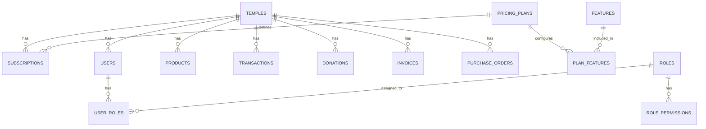

# Database Schema Documentation
## Omkaarya — Temple Management SaaS Platform

| Field | Details |
|-------|---------|
| **Document version** | 2.0 |
| **Date** | 22 April 2026 |
| **Author** | Database / Architecture Team |
| **Status** | Living document |

---

## 1. Overview

Omkaarya uses **PostgreSQL 15+** with a multi-tenant data model. Each tenant (temple) is isolated via a `temple_id` / `tenant_id` foreign key on all tenant-scoped tables. Platform-wide configuration tables (features, plan_features) have no tenant scoping.

### Connection Details

| Environment | Connection |
|-------------|-----------|
| Development | `DATABASE_URL` in `.env.local` |
| Staging | Managed PostgreSQL (Supabase / Neon) |
| Production | Managed PostgreSQL (Supabase / Neon / RDS) |

### Connection Pooling
- Pool size: 20 max connections
- Idle timeout: 30s
- Connection timeout: 2s
- Pattern: Singleton `Pool` instance in `lib/temples-db.ts`

---

## 2. Entity Relationship Diagram



---

## 3. Platform-Wide Tables (No Tenant Scope)

### 3.1 `features` — System Feature Registry

Stores all platform features in an L1 (Module) → L2 (Feature) hierarchy. L1 modules are derived from the `module_key` column.

```sql
CREATE TABLE features (
    id                       SERIAL PRIMARY KEY,
    name                     VARCHAR(255) NOT NULL,
    key                      VARCHAR(255) UNIQUE NOT NULL,       -- immutable after creation
    module_key               VARCHAR(100) NOT NULL,              -- L1 module grouping
    description              TEXT,
    has_limit                BOOLEAN DEFAULT FALSE,
    limit_type               VARCHAR(50),                        -- 'number' | 'boolean' | NULL
    is_active                BOOLEAN DEFAULT TRUE,               -- soft-delete via deactivation
    is_visible_in_plan_config BOOLEAN DEFAULT TRUE,              -- show in pricing plan config UI
    created_at               TIMESTAMP DEFAULT NOW(),
    updated_at               TIMESTAMP DEFAULT NOW()
);

-- Indexes
CREATE INDEX idx_features_module_key ON features(module_key);
CREATE INDEX idx_features_active ON features(is_active);
CREATE UNIQUE INDEX idx_features_key ON features(key);
```

**Key constraints:**
- `key` is UNIQUE and **immutable** — used in sidebar nav, route protection, API enforcement
- Features are **never deleted**, only deactivated (`is_active = false`)
- `module_key` values: `devotee`, `pooja`, `donation`, `inventory`, `finance`, `pos`, `system`

**Current seed data (14 features across 7 modules):**

| Module (L1) | Feature Key (L2) | Limit Type |
|-------------|-------------------|------------|
| devotee | devotee_management | none |
| devotee | devotee_communication | boolean |
| pooja | pooja_booking_online | none |
| pooja | pooja_booking_manual | none |
| pooja | archana_ticket_printing | boolean |
| donation | donation_basic_receipts | none |
| donation | donation_compliance_receipts | boolean |
| inventory | inventory_management | none |
| finance | finance_management | none |
| pos | pos_counter_sales | none |
| system | temple_microsite | none |
| system | custom_domain | none |
| system | seo_branding | none |
| system | advanced_analytics | none |

---

### 3.2 `plan_features` — Feature Configuration per Plan

Links features to pricing plans with toggle + limit values.

```sql
CREATE TABLE plan_features (
    id           SERIAL PRIMARY KEY,
    plan_id      VARCHAR(100) NOT NULL,               -- 'prarambha' | 'sankalpa' | 'aaradhana'
    feature_id   INTEGER REFERENCES features(id),
    is_enabled   BOOLEAN DEFAULT FALSE,
    limit_value  INTEGER,                             -- only used when feature.limit_type='number'
    created_at   TIMESTAMP DEFAULT NOW(),
    updated_at   TIMESTAMP DEFAULT NOW(),
    UNIQUE(plan_id, feature_id)
);

CREATE INDEX idx_plan_features_plan ON plan_features(plan_id);
```

**Plan IDs:**
| Plan ID | Display Name | Monthly | Yearly |
|---------|-------------|---------|--------|
| `prarambha` | Prarambha (Basic) | $19 | $157 |
| `sankalpa` | Sankalpa (Business) | $49 | $539 |
| `aaradhana` | Aaradhana (Enterprise) | $99 | $1,089 |

---

### 3.3 `pricing_plans` — Plan Definitions (Static)

Currently defined in `lib/temple-pricing-plans.ts` as TypeScript constants. Future: migrate to database table.

```sql
-- Future schema (not yet active)
CREATE TABLE pricing_plans (
    id           VARCHAR(100) PRIMARY KEY,
    name         VARCHAR(255) NOT NULL,
    description  TEXT,
    price_monthly DECIMAL(10,2) NOT NULL,
    price_yearly  DECIMAL(10,2) NOT NULL,
    included_seats INTEGER DEFAULT 3,
    extra_seat_cost DECIMAL(10,2),
    is_active    BOOLEAN DEFAULT TRUE,
    sort_order   INTEGER DEFAULT 0,
    created_at   TIMESTAMP DEFAULT NOW()
);
```

---

## 4. Tenant-Scoped Tables

### 4.1 `temples` — Tenant Master

```sql
CREATE TABLE temples (
    id              SERIAL PRIMARY KEY,
    name            VARCHAR(255) NOT NULL,
    slug            VARCHAR(255) UNIQUE,                -- subdomain: slug.omkaarya.com
    description     TEXT,
    address         TEXT,
    city            VARCHAR(100),
    state           VARCHAR(100),
    country         VARCHAR(100) DEFAULT 'IN',
    phone           VARCHAR(50),
    email           VARCHAR(255),
    website         VARCHAR(500),
    logo_url        VARCHAR(500),
    custom_domain   VARCHAR(255),
    plan_id         VARCHAR(100) DEFAULT 'prarambha',   -- FK to pricing plan
    is_active       BOOLEAN DEFAULT TRUE,
    created_at      TIMESTAMP DEFAULT NOW(),
    updated_at      TIMESTAMP DEFAULT NOW()
);

CREATE UNIQUE INDEX idx_temples_slug ON temples(slug);
```

---

### 4.2 `subscriptions` — Temple Subscriptions

```sql
CREATE TABLE subscriptions (
    id              SERIAL PRIMARY KEY,
    temple_id       INTEGER REFERENCES temples(id),
    plan_id         VARCHAR(100) NOT NULL,
    billing_cycle   VARCHAR(20) DEFAULT 'yearly',       -- 'monthly' | 'yearly'
    status          VARCHAR(50) DEFAULT 'pending',       -- 'active' | 'pending' | 'expired' | 'cancelled'
    start_date      DATE,
    end_date        DATE,
    amount          DECIMAL(10,2),
    payment_method  VARCHAR(50),
    payment_ref     VARCHAR(255),
    is_verified     BOOLEAN DEFAULT FALSE,
    verified_at     TIMESTAMP,
    verified_by     INTEGER,
    created_at      TIMESTAMP DEFAULT NOW(),
    updated_at      TIMESTAMP DEFAULT NOW()
);

CREATE INDEX idx_subscriptions_temple ON subscriptions(temple_id);
CREATE INDEX idx_subscriptions_status ON subscriptions(status);
```

---

### 4.3 `products` — Inventory Items

```sql
CREATE TABLE products (
    id              SERIAL PRIMARY KEY,
    temple_id       INTEGER REFERENCES temples(id),
    name            VARCHAR(255) NOT NULL,
    sku             VARCHAR(100),
    category        VARCHAR(100),                        -- 'Pooja Items', 'Prasad', 'Books', etc.
    description     TEXT,
    unit_price      DECIMAL(10,2) NOT NULL DEFAULT 0,
    cost_price      DECIMAL(10,2) DEFAULT 0,
    stock_quantity  INTEGER DEFAULT 0,
    min_stock       INTEGER DEFAULT 5,
    unit            VARCHAR(50) DEFAULT 'piece',         -- 'piece', 'kg', 'litre', 'packet'
    image_url       VARCHAR(500),
    is_active       BOOLEAN DEFAULT TRUE,
    created_at      TIMESTAMP DEFAULT NOW(),
    updated_at      TIMESTAMP DEFAULT NOW()
);

CREATE INDEX idx_products_temple ON products(temple_id);
CREATE INDEX idx_products_category ON products(category);
CREATE INDEX idx_products_sku ON products(temple_id, sku);
```

---

### 4.4 `transactions` — Finance Transactions

```sql
CREATE TABLE transactions (
    id              SERIAL PRIMARY KEY,
    temple_id       INTEGER REFERENCES temples(id),
    type            VARCHAR(20) NOT NULL,                -- 'income' | 'expense' | 'donation'
    category        VARCHAR(100),
    description     TEXT,
    amount          DECIMAL(10,2) NOT NULL,
    payment_method  VARCHAR(50),                         -- 'cash' | 'bank_transfer' | 'upi' | 'card'
    reference_id    VARCHAR(255),
    transaction_date DATE NOT NULL,
    recorded_by     INTEGER,
    notes           TEXT,
    created_at      TIMESTAMP DEFAULT NOW()
);

CREATE INDEX idx_transactions_temple ON transactions(temple_id);
CREATE INDEX idx_transactions_type ON transactions(temple_id, type);
CREATE INDEX idx_transactions_date ON transactions(temple_id, transaction_date);
```

---

### 4.5 `donations` — Donation Records

```sql
CREATE TABLE donations (
    id              SERIAL PRIMARY KEY,
    temple_id       INTEGER REFERENCES temples(id),
    donor_name      VARCHAR(255) NOT NULL,
    donor_email     VARCHAR(255),
    donor_phone     VARCHAR(50),
    donor_address   TEXT,
    amount          DECIMAL(10,2) NOT NULL,
    purpose         VARCHAR(255),                        -- 'General', 'Festival', 'Construction', etc.
    payment_method  VARCHAR(50),
    payment_ref     VARCHAR(255),
    receipt_number  VARCHAR(100),
    gift_aid        BOOLEAN DEFAULT FALSE,               -- UK Gift Aid eligible
    tax_receipt     BOOLEAN DEFAULT FALSE,
    donation_date   DATE NOT NULL,
    notes           TEXT,
    created_at      TIMESTAMP DEFAULT NOW()
);

CREATE INDEX idx_donations_temple ON donations(temple_id);
CREATE INDEX idx_donations_date ON donations(temple_id, donation_date);
CREATE INDEX idx_donations_donor ON donations(temple_id, donor_name);
```

---

### 4.6 `invoices` — Invoice Records

```sql
CREATE TABLE invoices (
    id              SERIAL PRIMARY KEY,
    temple_id       INTEGER REFERENCES temples(id),
    invoice_number  VARCHAR(100) NOT NULL,
    customer_name   VARCHAR(255),
    customer_email  VARCHAR(255),
    items           JSONB NOT NULL,                      -- [{name, qty, unit_price, amount}]
    subtotal        DECIMAL(10,2) NOT NULL,
    tax_amount      DECIMAL(10,2) DEFAULT 0,
    total           DECIMAL(10,2) NOT NULL,
    status          VARCHAR(50) DEFAULT 'draft',         -- 'draft' | 'sent' | 'paid' | 'overdue'
    due_date        DATE,
    notes           TEXT,
    created_at      TIMESTAMP DEFAULT NOW()
);

CREATE INDEX idx_invoices_temple ON invoices(temple_id);
CREATE UNIQUE INDEX idx_invoices_number ON invoices(temple_id, invoice_number);
```

---

### 4.7 `purchase_orders` — Purchase Orders

```sql
CREATE TABLE purchase_orders (
    id              SERIAL PRIMARY KEY,
    temple_id       INTEGER REFERENCES temples(id),
    po_number       VARCHAR(100) NOT NULL,
    vendor_name     VARCHAR(255),
    items           JSONB NOT NULL,
    total           DECIMAL(10,2) NOT NULL,
    status          VARCHAR(50) DEFAULT 'pending',       -- 'pending' | 'approved' | 'received' | 'cancelled'
    order_date      DATE NOT NULL,
    expected_date   DATE,
    notes           TEXT,
    created_at      TIMESTAMP DEFAULT NOW()
);

CREATE INDEX idx_purchase_orders_temple ON purchase_orders(temple_id);
```

---

## 5. User & RBAC Tables

### 5.1 `users`

```sql
CREATE TABLE users (
    id              SERIAL PRIMARY KEY,
    temple_id       INTEGER REFERENCES temples(id),      -- NULL for super admins
    name            VARCHAR(255) NOT NULL,
    email           VARCHAR(255) UNIQUE NOT NULL,
    password_hash   VARCHAR(255),
    user_type       VARCHAR(50) NOT NULL,                -- 'super_admin' | 'temple_admin' | 'staff'
    is_active       BOOLEAN DEFAULT TRUE,
    last_login      TIMESTAMP,
    created_at      TIMESTAMP DEFAULT NOW()
);

CREATE INDEX idx_users_temple ON users(temple_id);
CREATE INDEX idx_users_email ON users(email);
```

### 5.2 `roles`

```sql
CREATE TABLE roles (
    id              SERIAL PRIMARY KEY,
    name            VARCHAR(100) NOT NULL,
    description     TEXT,
    is_system       BOOLEAN DEFAULT FALSE,               -- system roles cannot be deleted
    created_at      TIMESTAMP DEFAULT NOW()
);
```

### 5.3 `user_roles`

```sql
CREATE TABLE user_roles (
    user_id   INTEGER REFERENCES users(id),
    role_id   INTEGER REFERENCES roles(id),
    PRIMARY KEY (user_id, role_id)
);
```

### 5.4 `role_permissions`

```sql
CREATE TABLE role_permissions (
    role_id     INTEGER REFERENCES roles(id),
    permission  VARCHAR(255) NOT NULL,                   -- e.g. 'inventory.create', 'finance.view'
    PRIMARY KEY (role_id, permission)
);
```

---

## 6. Migration Strategy

### 6.1 Migration File Location
```
docs/migrations/
├── 001_initial_schema.sql
├── 002_feature_registry.sql
└── 003_plan_features.sql
```

### 6.2 Migration Execution
```bash
# Run against local/staging database
psql $DATABASE_URL -f docs/migrations/002_feature_registry.sql
```

### 6.3 Seed Data
Feature registry seed data is currently maintained in the React component as static `INITIAL_MODULES` constant. Future: SQL seed file.

---

## 7. Query Patterns

### 7.1 Tenant-Scoped Query Pattern
```typescript
// ALWAYS filter by temple_id for tenant-scoped tables
const result = await pool.query(
  'SELECT * FROM products WHERE temple_id = $1 AND is_active = true ORDER BY name',
  [templeId]
);
```

### 7.2 Feature Access Check Pattern
```typescript
// Check if a feature is enabled for a tenant's plan
const result = await pool.query(`
  SELECT pf.is_enabled, pf.limit_value
  FROM plan_features pf
  JOIN features f ON f.id = pf.feature_id
  WHERE pf.plan_id = $1 AND f.key = $2 AND f.is_active = true
`, [planId, featureKey]);
```

### 7.3 Module Feature Summary
```typescript
// Get all features grouped by module for Feature Registry
const result = await pool.query(`
  SELECT module_key, 
         COUNT(*) as total,
         COUNT(*) FILTER (WHERE is_active) as active
  FROM features
  GROUP BY module_key
  ORDER BY module_key
`);
```

---

## 8. Backup & Recovery (Planned)

| Aspect | Strategy |
|--------|----------|
| Automated backups | Daily via managed PostgreSQL provider |
| Point-in-time recovery | 7-day retention window |
| Data export | CSV export via Reports module |
| Audit trail | `created_at`, `updated_at` on all tables |

---

## 9. Super Admin RBAC Tables (Migration 019)

### 9.1 `sa_roles` — Platform-Level Roles

```sql
CREATE TABLE IF NOT EXISTS sa_roles (
  id          SERIAL PRIMARY KEY,
  name        VARCHAR(100) NOT NULL UNIQUE,
  description TEXT,
  is_active   BOOLEAN NOT NULL DEFAULT TRUE,
  created_at  TIMESTAMPTZ NOT NULL DEFAULT NOW(),
  updated_at  TIMESTAMPTZ NOT NULL DEFAULT NOW()
);
```

**Seed data:** Super Admin, Support Agent, Finance Reviewer

---

### 9.2 `sa_role_permissions` — Feature Access per Role

```sql
CREATE TABLE IF NOT EXISTS sa_role_permissions (
  id           SERIAL PRIMARY KEY,
  role_id      INTEGER NOT NULL REFERENCES sa_roles(id) ON DELETE CASCADE,
  feature_key  VARCHAR(255) NOT NULL,     -- references features.key
  access_level VARCHAR(20) NOT NULL DEFAULT 'none'
               CHECK (access_level IN ('none', 'view', 'full')),
  UNIQUE (role_id, feature_key)
);
```

**Access Levels:**
| Level | Meaning |
|-------|---------|
| `none` | Feature hidden from this role |
| `view` | Read-only access |
| `full` | Full create/edit/delete access |

---

### 9.3 `sa_users` — Platform Administrator Accounts

```sql
CREATE TABLE IF NOT EXISTS sa_users (
  id         SERIAL PRIMARY KEY,
  name       VARCHAR(255) NOT NULL,
  email      VARCHAR(255) NOT NULL UNIQUE,
  role_id    INTEGER REFERENCES sa_roles(id) ON DELETE SET NULL,
  is_active  BOOLEAN NOT NULL DEFAULT TRUE,
  last_login TIMESTAMPTZ,
  created_at TIMESTAMPTZ NOT NULL DEFAULT NOW(),
  updated_at TIMESTAMPTZ NOT NULL DEFAULT NOW()
);
```

---

### 9.4 Corresponding API Endpoints

| Method | Endpoint | Purpose |
|--------|----------|---------|
| GET | `/api/admin-users` | List all Super Admin users |
| POST | `/api/admin-users` | Create a new Super Admin user |
| GET | `/api/admin-users/[id]` | Get a single user |
| PATCH | `/api/admin-users/[id]` | Update or toggle active state |
| DELETE | `/api/admin-users/[id]` | Remove a user |
| GET | `/api/admin-roles` | List all roles with user counts |
| POST | `/api/admin-roles` | Create a new role |
| GET | `/api/admin-roles/[id]/permissions` | Get permissions for a role |
| PUT | `/api/admin-roles/[id]/permissions` | Replace all permissions for a role |

---

### 9.5 DB Library

`lib/sa-users-db.ts` — provides typed functions:
- `fetchAllSaUsers()`, `fetchSaUserById(id)`, `insertSaUser(input)`, `updateSaUser(id, input)`, `toggleSaUserActive(id)`, `deleteSaUser(id)`
- `fetchAllSaRoles()`, `insertSaRole(input)`, `fetchRolePermissions(roleId)`, `saveRolePermissions(roleId, permissions)`
